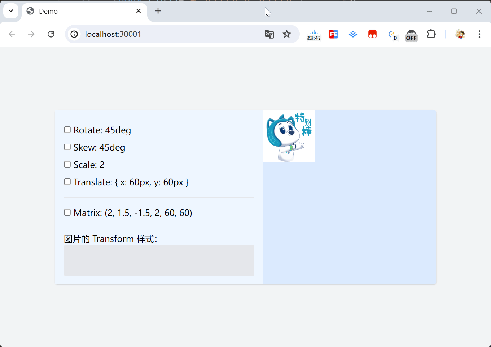

# 介绍

用于`transform`示例的 demo 项目

示例图如下


## 准备 demo 项目

首先新建一个`demo`文件夹，在`demo`文件夹路径下执行

```bash
npm init -y
```

完成`demo`项目创建，然后安装`vite`
```bash
npm i -D vite@latest
```
新建`vite.config.js`文件，内容如下
```js
import { defineConfig } from 'vite';

export default defineConfig({
  server: {
    port: 30001,
  },
});
```

---

为了方便写样式，我们安装CSS工具`tailwindcss`
```bash
npm install -D tailwindcss
```
新建`src/assets/css/tailwind.css`文件，内容如下
```css
@tailwind base;
@tailwind components;
@tailwind utilities;
```
新建`tailwind.config.js`文件，内容如下
```js
/** @type {import('tailwindcss').Config} */
module.exports = {
  content: ["index.html", "./src/**/*.{html,js}"],
  theme: {
    extend: {},
  },
  plugins: [],
}
```

给项目添加脚本命令
```json
{
  "scripts": {
    "dev": "npm run css | vite",
    "css": "npx tailwindcss -i ./src/assets/css/tailwind.css -o ./src/assets/css/index.css --watch"
  },
}
```

新建`src/main.js`文件，并在`index.html`中引入

## 运行 demo 查看效果

```bash
npm run dev
```